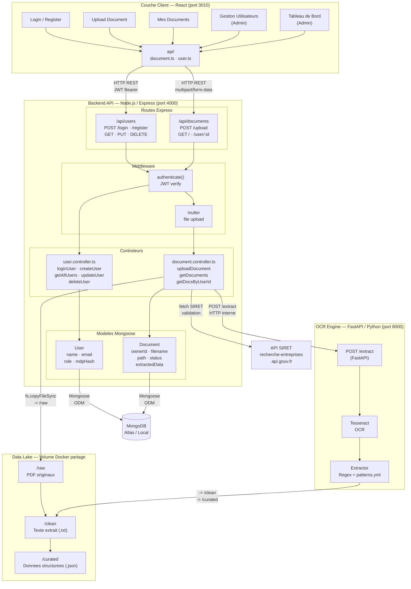
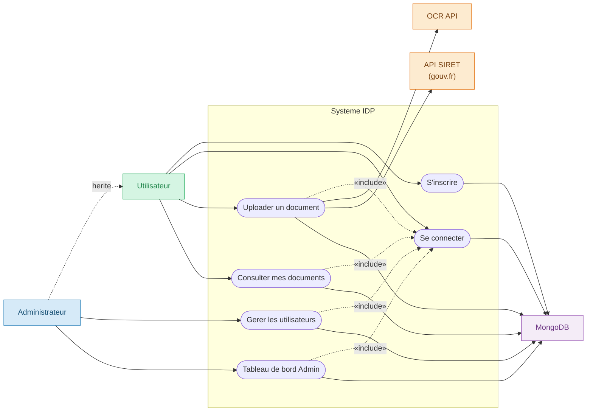
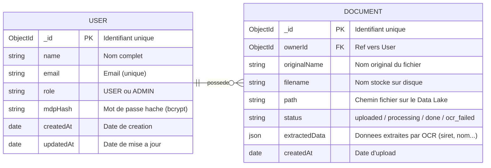

# Hackathon

Ce projet propose une solution complete d'Intelligence Document Processing (IDP). Elle met en place tous les services necessaires pour la plateforme automatisee de traitement de documents administratifs.

## Application en ligne

L'application a ete deployee et est accessible a l'adresse suivante :
**[https://hackathon26.lulu960.xyz](https://hackathon26.lulu960.xyz)**

## Stack Technique

| Domaine | Technologies |
|---|---|
| **Frontend** | React, API Fetch, CSS Vanilla |
| **Backend API** | Node.js, Express, TypeScript, Mongoose, JWT, Multer |
| **OCR Engine** | Python, FastAPI, Tesseract OCR |
| **Base de donnees** | MongoDB |
| **DevOps / Infra** | Docker, Docker Compose |

## Architecture des dossiers

```
/hackathon-idp
├── /data-lake               # Volume local pour le stockage des fichiers partages
│   ├── /raw                 # Documents originaux
│   ├── /clean               # Texte brut (txt) extrait de l'OCR
│   └── /curated             # Donnees structurees (json) validees
├── /airflow                 # Orchestration des data pipelines (Airflow)
├── /ml-ocr-engine           # API Backend OCR en Python (FastAPI + Tesseract)
├── /app-crm                 # Application CRM principale
│   ├── /frontend            # React App (Interface Utilisateur)
│   └── /backend             # Node.js/Express App (API principale)
└── docker-compose.yml       # Fichier d'orchestration global
```

## Comment lancer le projet complet

Assurez-vous d'avoir Docker et Docker Compose installes sur votre machine.

1. Allez a la racine du projet :
```bash
cd "Hackathon 2026/hackathon-idp"
```

2. Lancez la construction et le demarrage des conteneurs en tache de fond :
```bash
docker-compose up --build -d
```

## Architecture des ports et acces locaux

Les services suivants seront exposes apres le lancement des conteneurs via Docker :

### Frontends
- **App CRM (React)** : http://localhost:3010

### Backends / APIs
- **App CRM Backend (Node/Express)** : http://localhost:4000
- **ML OCR Engine (FastAPI)** : http://localhost:8000

Une fois les tests valides, arretez les services avec :
```bash
docker-compose down
```

---

## Architecture Technique Detaillee



### Description des composants

#### Frontend — React (port 3010)

| Fichier | Role |
|---|---|
| `Login.jsx` / `Register.jsx` | Authentification utilisateur |
| `Upload.jsx` | Depot de fichier PDF |
| `MyDocuments.jsx` | Liste + filtre des documents |
| `DashboardAdmin.jsx` | Stats (nb users, nb docs) |
| `UsersManagement.jsx` | CRUD utilisateurs (Admin) |
| `api/document.ts` · `api/user.ts` | Appels REST vers le backend |

#### Backend — Node.js / Express + TypeScript (port 4000)

| Composant | Role |
|---|---|
| `authenticate()` middleware | Verifie le JWT sur toutes les routes protegees |
| `multer` middleware | Reception du fichier PDF en `multipart/form-data` |
| `user.controller.ts` | Login (bcrypt + JWT), CRUD utilisateurs |
| `document.controller.ts` | Upload -> appel OCR -> validation SIRET -> save MongoDB |
| `User` model | Schema Mongoose : role `USER` ou `ADMIN` |
| `Document` model | Schema Mongoose : status (`processing` / `done` / `ocr_failed`) |

#### OCR Engine — FastAPI / Python (port 8000)

| Composant | Role |
|---|---|
| `POST /extract` | Recoit le PDF, declenche le pipeline OCR |
| `tesseract_script.py` | Conversion PDF -> texte via Tesseract OCR |
| `extractor.py` | Extraction des champs avec regex |
| Resultats | Sauvegarde `.txt` dans `/clean` et `.json` dans `/curated` |

#### Data Lake — Volume Docker partage

| Zone | Contenu |
|---|---|
| `/raw` | PDF originaux uploades par les utilisateurs |
| `/clean` | Texte brut extrait par Tesseract |
| `/curated` | JSON structure avec les champs extraits |

#### Securite et Deploiement

- **JWT** signe avec `JWT_SECRET` (env var), expiration 24h
- **bcrypt** pour le hashage des mots de passe
- Route `GET /documents/user/:id` reservee aux **ADMIN** uniquement
- Services Docker : Frontend (`node:18-alpine`), Backend (`node:20-alpine`), OCR API (Python custom)

---

## Diagramme des Cas d'Utilisation



---

## Modele Conceptuel de Donnees (MCD)



### Description des entites

#### USER

| Attribut | Type | Contrainte | Description |
|---|---|---|---|
| `_id` | ObjectId | PK, auto | Identifiant MongoDB |
| `name` | String | required | Nom complet de l'utilisateur |
| `email` | String | required, unique | Adresse email (cle de login) |
| `role` | String | enum | `USER` (defaut) ou `ADMIN` |
| `mdpHash` | String | required | Mot de passe hache via bcrypt |
| `createdAt` / `updatedAt` | Date | auto | Genere par `timestamps: true` |

#### DOCUMENT

| Attribut | Type | Contrainte | Description |
|---|---|---|---|
| `_id` | ObjectId | PK, auto | Identifiant MongoDB |
| `ownerId` | ObjectId | FK -> USER | Proprietaire du document |
| `originalName` | String | required | Nom original du fichier uploade |
| `filename` | String | required | Nom genere pour le stockage |
| `path` | String | required | Chemin absolu sur le Data Lake |
| `status` | String | default: "uploaded" | Etat du pipeline OCR |
| `extractedData` | Mixed (JSON) | nullable | Champs extraits : siret, nom, adresse... |
| `createdAt` | Date | auto | Date d'upload |

#### Valeurs possibles du statut (DOCUMENT)

| Statut | Signification |
|---|---|
| `uploaded` | Fichier recu, traitement en attente |
| `processing` | Pipeline OCR en cours |
| `done` | Extraction reussie, donnees disponibles |
| `ocr_failed` | Echec de l'extraction OCR |
